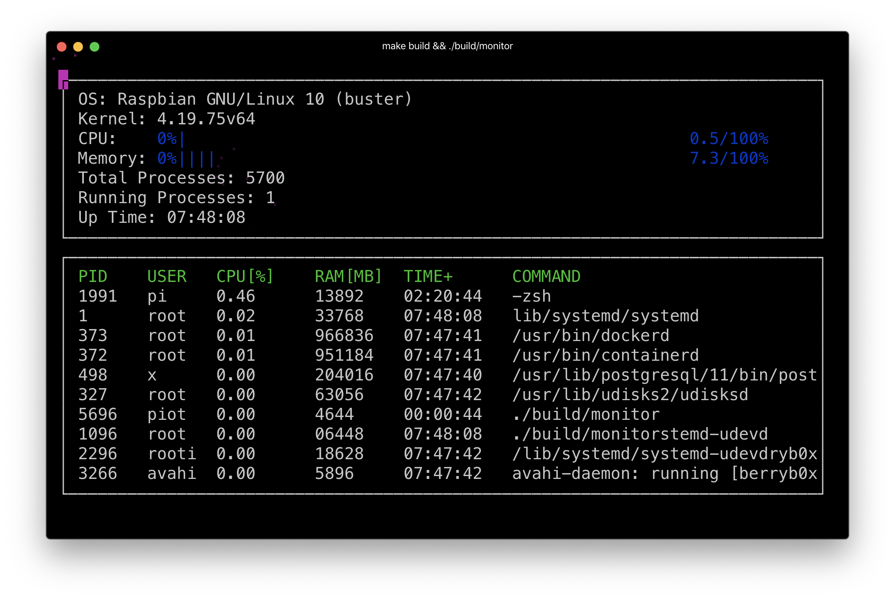
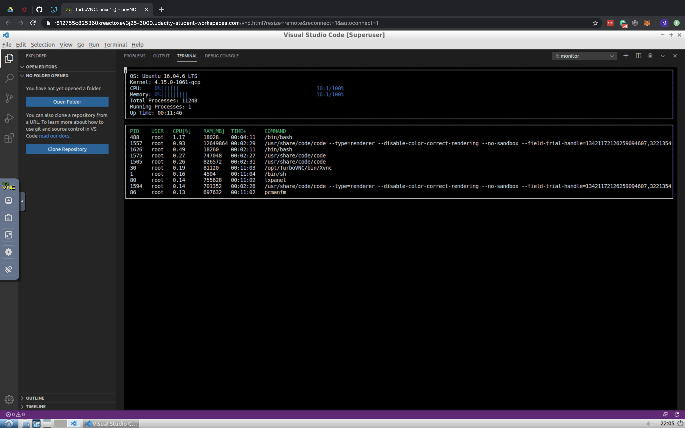

# Udacity C++ Nanodegree System Monitor Project

## Make
This project uses [Make](https://www.gnu.org/software/make/). The Makefile has five targets:
* `build`  compiles the source code and generates an executable
* `test`   Runs unit tests, does not build source
* `format` applies [ClangFormat](https://clang.llvm.org/docs/ClangFormat.html) to style the source code
* `debug`  compiles the source code and generates an executable, including debugging symbols
* `clean`  deletes the `build/` directory, including all of the build artifacts

## About `make test`
You cannot build the system monitor on OSX and I did not want to keep uploading changes to my separate Linux machine so I created unit tests for each `.h` file to test locally on OSX. If it passed then I pulled the changed down on the separate Linux machine and tested the build there.

## Build Examples

1. Built on a Raspberry Pi running RaspbianOS

2. Built on the Udacity Virtual Workspace
 